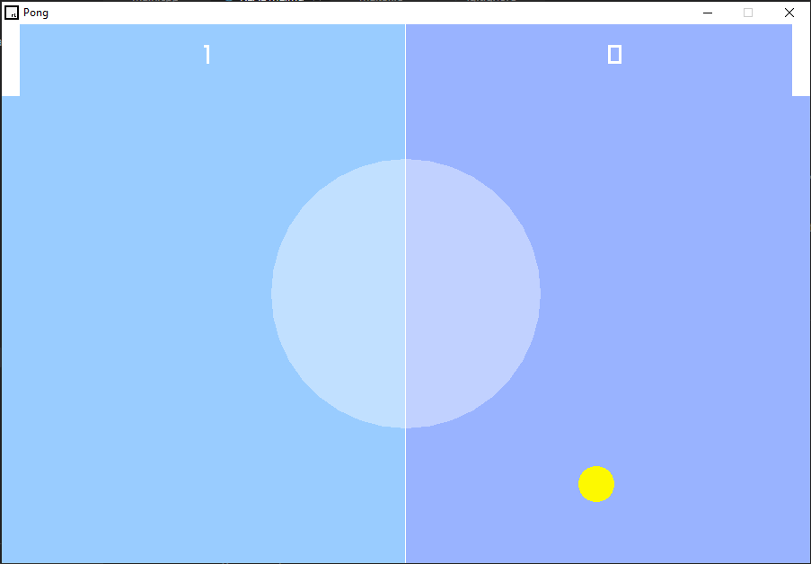

# Pong Game Documentation

## Overview
Pong is a classic arcade game where players control paddles to hit a ball back and forth. The objective is to score points by making the ball pass the opponent's paddle.

## Features
- Two-player mode: Players can compete against each other using two paddles.
- Simple controls: Player 1 uses arrow keys (Up and Down), and Player 2 uses the 'W' and 'S' keys to control their paddles.
- Ball movement: The ball moves in a straight line, bouncing off walls and paddles.
- Scoring: Each time the ball passes the opponent's paddle, the opposing player scores a point.
- Win condition: The game ends when one player reaches a set number of points (e.g., 10).

## Controls
- Player 1:
  - Up Arrow: Move paddle up
  - Down Arrow: Move paddle down

- Player 2:
  - W: Move paddle up
  - S: Move paddle down

## Installation
1. Clone or download the Pong game repository from GitHub.
2. Ensure you have the necessary dependencies installed (e.g., Raylib).
3. Compile the source code using your preferred compiler.
4. Run f5 to start the game.

## Future Enhancements
- Add a single-player mode with an AI opponent.
- Implement sound effects and background music.
- Add options menu for customization (e.g., paddle speed, ball speed).
- Improve game graphics and animations.

## Credits
- Built using [Raylib](https://www.raylib.com/)
- Inspired by the classic arcade game Pong